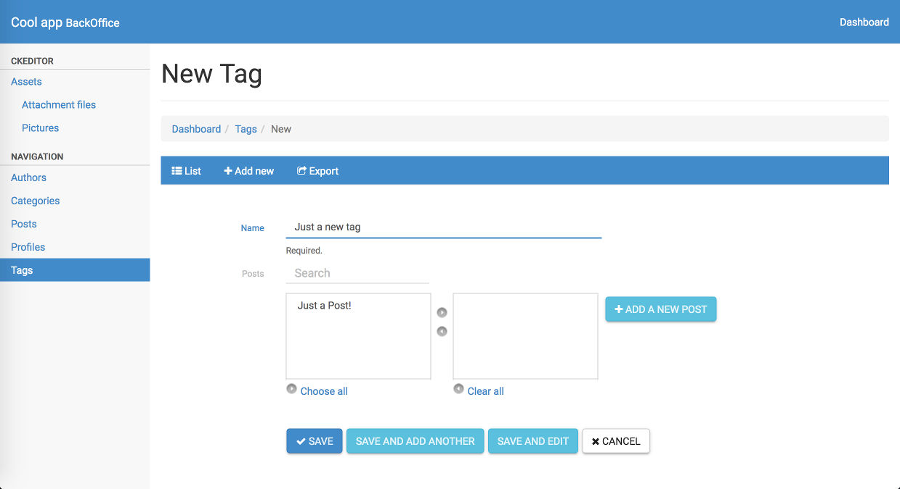
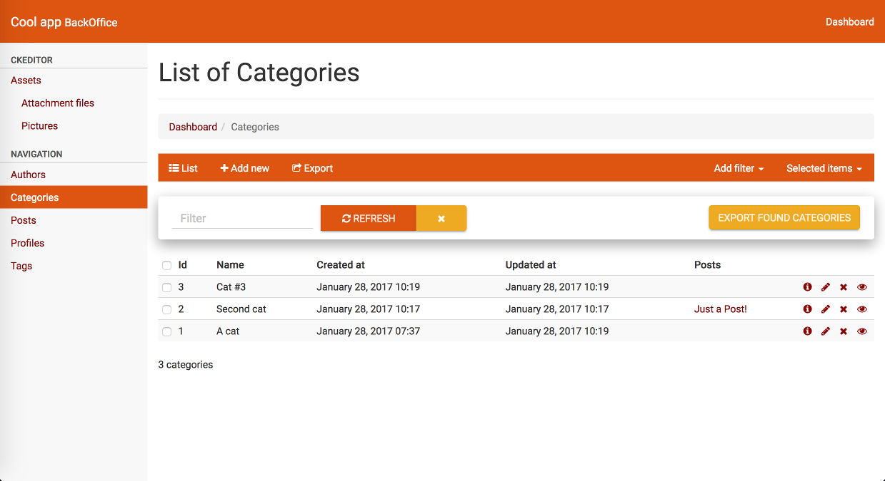

# RailsAdminMaterial theme [](https://badge.fury.io/rb/rails_admin_material)

A Material Design theme for [rails_admin](https://github.com/sferik/rails_admin).

Features:

- Material user interface

- improve nested forms styles

- hide/show sidebar

Demo: [heroku app](http://rails-admin-material.herokuapp.com/admin/)

## Installation

- Add the gem to Gemfile (and execute *bundle*): `gem 'rails_admin_material'`

- Enable the theme in *config/application.rb* (just after *Bundler.require* line): `ENV['RAILS_ADMIN_THEME'] = 'material'`

- Edit or create *app/assets/javascripts/rails_admin/custom/ui.js* and add: `//= require rails_admin/themes/material/ui.js`

## Customization

To change theme colors add / edit *app/assets/stylesheets/rails_admin/custom/variables.scss*:

```sass
// orange theme sample
$brand-primary: #d51;
$brand-info: #ea2;
$link-color: #800;
$nav-pills-active-link-hover-bg: #d51;
$btn-primary-bg: #d51;
$btn-primary-border: #da0;
$btn-info-bg: #fa4;
$btn-info-border: #da0;
$fg-nav-tabs-active: #fb1;
```

## Preview





## Notes

Based on [Material Design for Bootstrap](http://fezvrasta.github.io/bootstrap-material-design/)

If the styles are not applied try to clean the Rails pipeline cache:

```sh
rake assets:clean
rake assets:precompile
```

Sass errors? Try updating sass-rails (or sassc-rails): `bundle update sass-rails`

## Do you like it? Star it!

If you use this component just star it. A developer is more motivated to improve a project when there is some interest.

## Contributors

- [Mattia Roccoberton](http://blocknot.es) - creator, maintainer

## License

[ISC](LICENSE)
